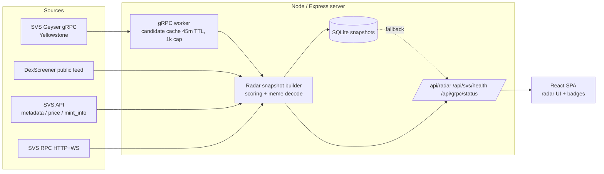

# Architecture — Meme Velocity Radar

## Overview

Meme Velocity Radar is a single Node/Express process that serves both the API and the Vite/React SPA. Live Solana data flows in from a Yellowstone gRPC worker (when enabled) and from DexScreener; SVS API enriches what we have. The radar JSON snapshot is the single product surface, exposed as `/api/radar` and as an SSE stream.

## System diagram

## Data pipeline

1. **gRPC live ingestion.** Yellowstone client subscribes to transactions on the watched program IDs. Filters are grouped (`launchpads`, `dexPools`). The worker parses token-balance deltas, drops blocklisted base mints (SOL/wSOL, USDC/USDT, BONK, WIF, etc.), and writes each candidate mint into an in-memory cache keyed by mint address. TTL 45m, hard cap 1000 entries.
2. **DexScreener scan.** On each radar build, the server hits DexScreener public endpoints for trending Solana pairs. This is the always-on fallback path.
3. **Candidate merge.** gRPC candidates are prioritised. DexScreener supplies pair, liquidity, and price data when it has them. gRPC mints with no DexScreener pair surface as `grpc-only` early-signal entries with a conservative score.
4. **SVS enrichment (optional).** When `SVS_API_KEY` is set and not in auth cooldown, the builder fetches metadata, mint info, and price windows for the merged candidates.
5. **Score.** The builder computes velocity / virality / upside / risk per token, emits `riskFlags`, decodes the meme narrative from name/description/socials, and tags `sourceTags` (`dexscreener`, `svs-metadata`, `svs-price`, `grpc-live`, `grpc-transaction`).
6. **Snapshot.** The builder produces a `RadarSnapshot` and writes it to SQLite. The most recent snapshot is the stale-fallback served when upstream is slow or down.
7. **Serve.** `/api/radar` returns the live or cached snapshot under a hard deadline. `/api/radar/stream` (SSE) pushes a fresh snapshot every ~20s. The header badges read from `/api/svs/health` and `/api/grpc/status`.

Refresh interval: ~20s. Max candidates per snapshot: 14. In-process snapshot cache: ~25s.

## Components

| Component | File | Purpose |
| --- | --- | --- |
| Express entrypoint | `server/index.ts` | Boots HTTP server, wires routes, serves the SPA in production. |
| Routes & snapshot builder | `server/routes.ts` | DexScreener scanner, scoring, snapshot assembly, deadline guards, SSE. |
| SVS enrichment | `server/svs.ts` | Metadata / mint info / price calls, RPC health, auth cooldown logic. |
| gRPC live worker | `server/grpcStream.ts` | Yellowstone client, filter management, candidate cache, diagnostics. |
| Storage | `server/storage.ts` | SQLite snapshot persistence (better-sqlite3). |
| Static / Vite glue | `server/static.ts`, `server/vite.ts` | Serve built SPA in prod, Vite middleware in dev. |
| Shared schema | `shared/schema.ts` | `RadarSnapshot`, `TokenSignal`, `MetaSignal` types shared with the client. |
| Client SPA | `client/src/**` | Radar dashboard, header badges, CSV export. |

## Data sources

| Source | Used for | Auth | Required? |
| --- | --- | --- | --- |
| **DexScreener public API** (`api.dexscreener.com`) | Trending pairs, price/volume/liquidity, profile metadata, boost info. | None. | No — always-on fallback. |
| **SVS API** | Per-mint metadata, mint authority info, price windows, ranking. | `Authorization: Bearer SVS_API_KEY`. | Optional. Without it, badges show `not configured` and SVS-derived enrichment is skipped. |
| **SVS RPC HTTP/WS** | Health probe (`getLatestBlockhash`); reserved for future on-chain reads. | API key in URL. | Optional. |
| **SVS Geyser gRPC** (`@triton-one/yellowstone-grpc`) | Live transaction stream from Solana for the watched program IDs. | `SVS_GRPC_X_TOKEN` (or IP whitelist on some plans). | Optional. Without it, the radar runs DexScreener-only. |
| **SQLite (better-sqlite3)** | Local persistence of the most recent radar snapshot for the stale-fallback path. | Local file. | Yes, but managed automatically. |

## Safety & resilience

- **Hard deadlines.** `/api/radar` and `/api/svs/health` run under bounded deadlines and return a stale-snapshot or degraded-fallback report rather than hang. `/api/grpc/status` is synchronous and never reaches outside the process.
- **Stale-snapshot fallback.** If the live build fails, the latest SQLite snapshot is returned with a `cache: degraded` marker added to `sourceHealth` so the client can flag it.
- **Auth cooldown.** When the SVS API returns 401 or 403, a cooldown window short-circuits subsequent paid SVS calls until it expires. The radar continues without SVS during the cooldown. The cooldown state is exposed in `/api/svs/health.authCooldown`.
- **Compact logging.** The gRPC worker emits one-line, bounded log lines and exposes counters via `/api/grpc/status.diagnostics` instead of dumping per-event logs. This is what keeps a small Railway log buffer usable when AMM v4 is on.
- **Bounded candidate cache.** 45-minute TTL and 1000-mint cap on the in-memory candidate cache to bound memory regardless of stream volume.
- **Reconnect backoff.** The worker reconnects with exponential backoff (1s → 30s) plus a 30s keepalive ping. Failures never crash the web server.
- **Stable-mint blocklist.** The worker filters out SOL, wSOL, USDC, USDT, mSOL, jitoSOL, BONK, WIF, ETH (wormhole), JUP from candidate emission so high-volume stable pairs don't dominate the list.
- **AMM v4 opt-in.** Raydium AMM v4, the highest-volume mature pool stream, is **off by default**. Either `ENABLE_RAYDIUM_AMM_V4=true` or an explicit `WATCH_RAYDIUM_AMM_V4_PROGRAM` value is treated as opt-in. This is the resolution to the production OOM that was hitting small Railway containers (commit 793a5e1).
- **Conservative `grpc-only` scoring.** Candidates that show only on gRPC (no DexScreener pair yet) cannot dominate the ranking. They surface with `riskFlags: ["pre-dex or no pair yet", "grpc-only early signal"]` as a watchlist seed, not a buy signal.
- **No browser-exposed secrets.** No env var is prefixed `VITE_`; the SPA only reads `/api/svs/health` and `/api/grpc/status`, both of which return booleans/status strings rather than secret values.

## Limitations

- **Heuristic scoring.** Velocity / virality / upside / risk are derived from public metrics and pattern matching. They are not a model and not predictive in any rigorous sense.
- **No protocol-specific decoders yet.** The gRPC parser detects token-balance deltas and pulls the candidate mint, but it doesn't decode pool-create instructions per-protocol. A token can show up before its pool is "officially" created, but we don't yet expose the create event itself.
- **No on-chain risk scoring.** Mint authority, freeze authority, top-holder concentration, and creator-wallet history are not factored into the score yet.
- **No social signals.** No X / Telegram / Discord ingestion. "Virality" today is derived from on-chain trading and DexScreener boosts, not real social reach.
- **No backtesting / historical store.** SQLite holds only the most recent snapshot for fallback. There is no time-series database.
- **No execution path.** This is observation-only. There is no order placement, no Lightspeed / Jito relay, no wallet integration.
- **Single process.** Worker, snapshot builder, and HTTP all run in one Node process. Horizontal scaling would require splitting the worker out.
- **AMM v4 not safe on small containers.** Even with the opt-in gating, AMM v4 will saturate a small Railway plan; you need a sized host before turning it on.
